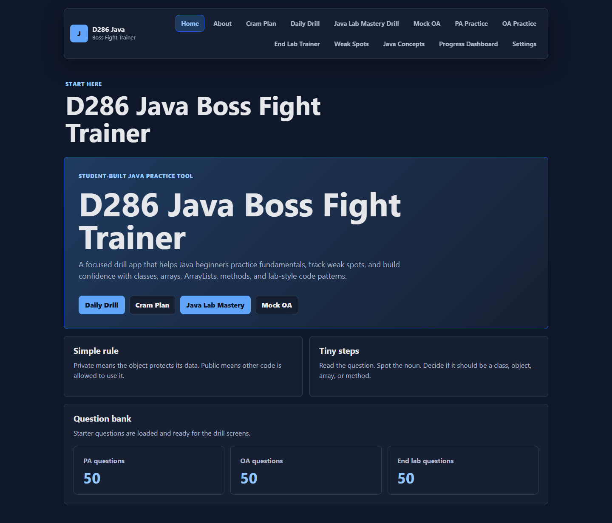
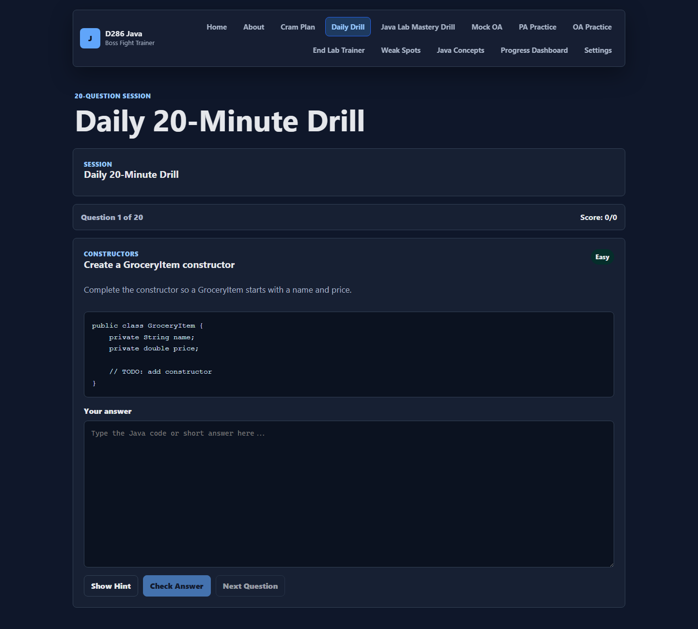
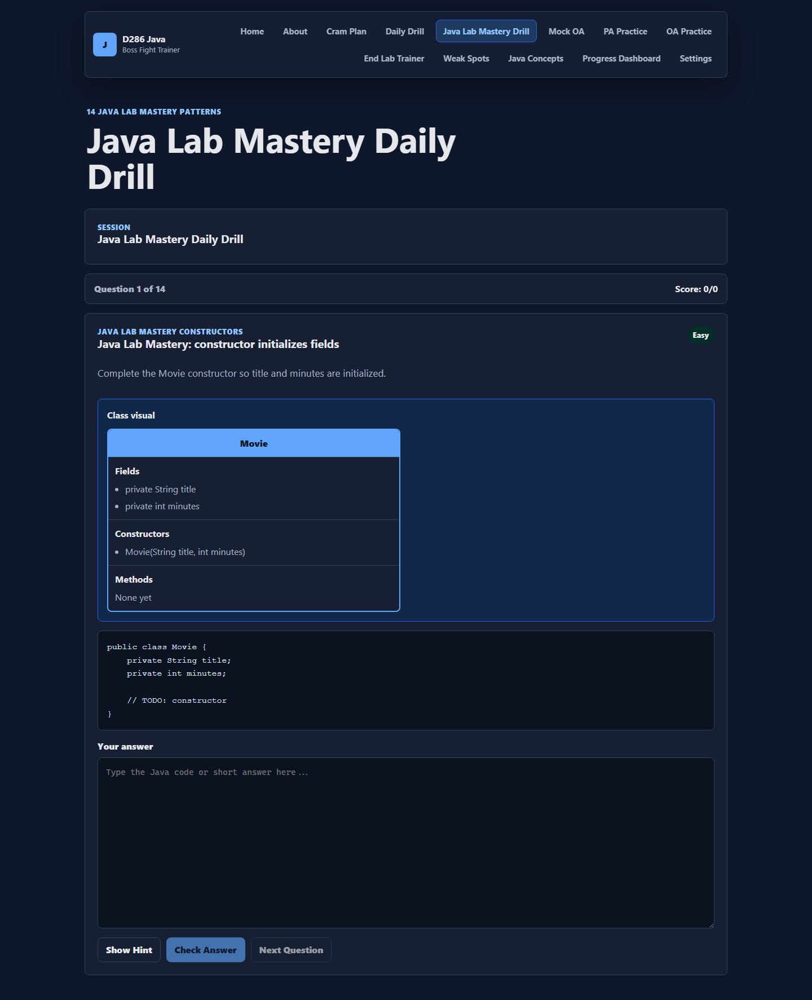
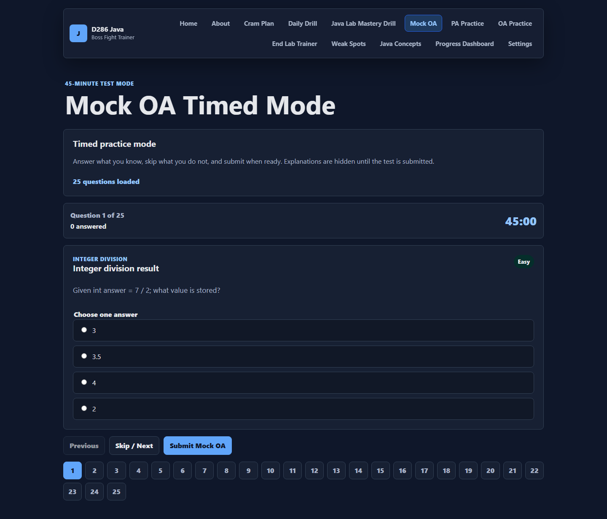
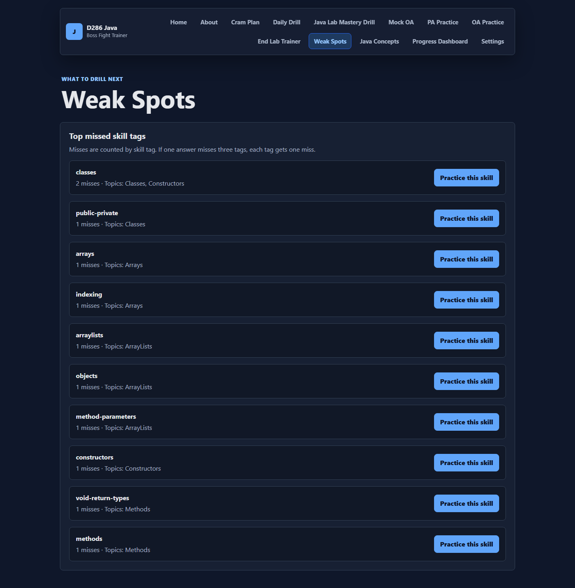
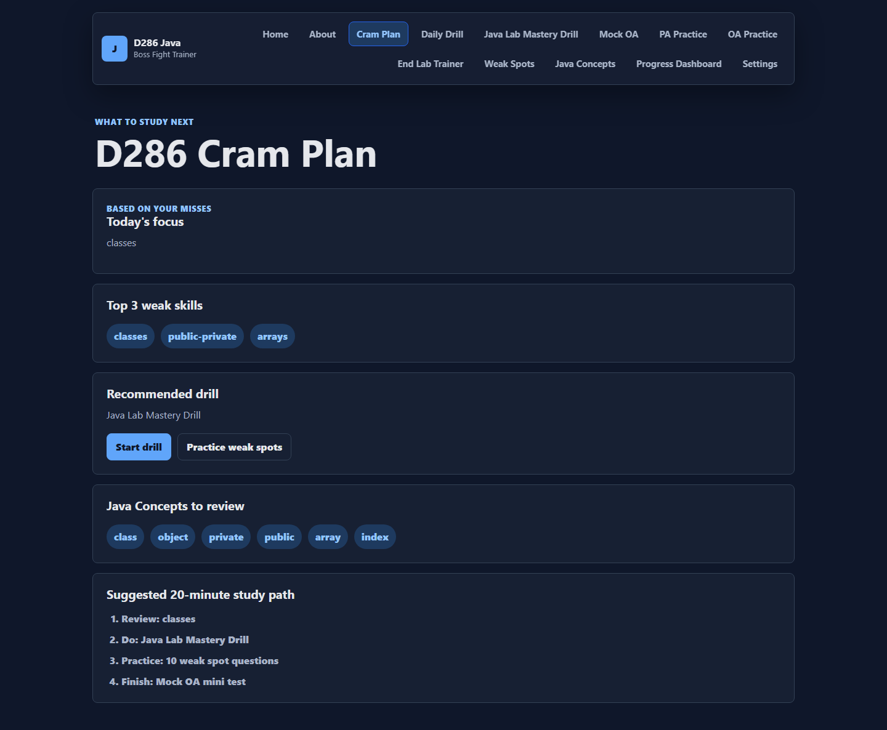
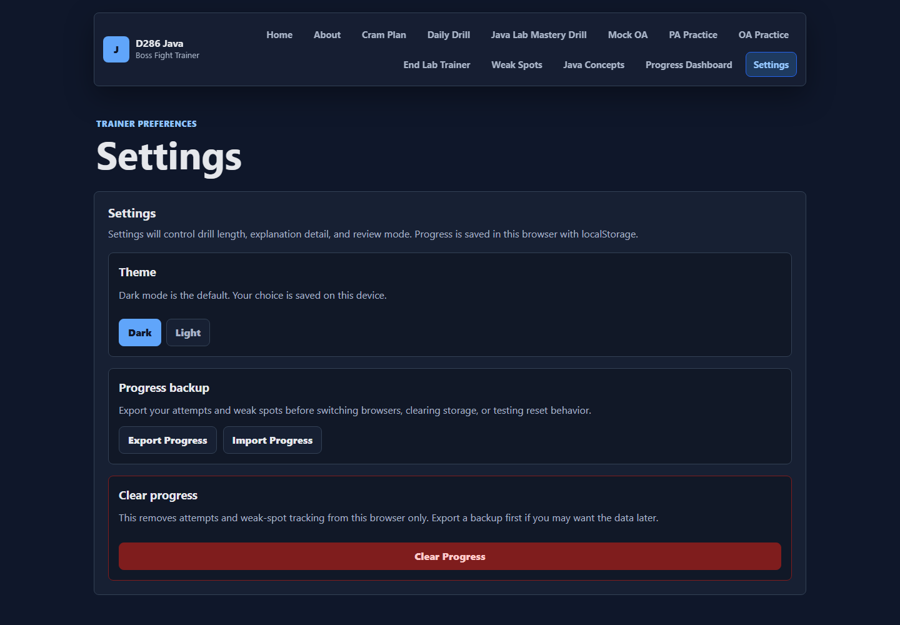

# D286 Java Boss Fight Trainer

**A student-built React learning app that turns beginner Java fundamentals into adaptive drills, visual explanations, timed practice, and weak-spot review.**

## Demo

The app simulates a practical Java study workflow: start a Daily Drill, miss a question, review the mistake lesson, see the skill appear in Weak Spots, then generate a Cram Plan based on local progress.

## Why I Built This

Beginner Java students often understand a concept once, then freeze when they need to apply it in code. I built this project to turn repeated friction points like classes, objects, arrays, ArrayLists, constructors, `public/private`, `void`, and return types into small practice loops with immediate feedback.

## Features

- Daily Drill with weak-spot prioritization
- Java Lab Mastery Drill for lab-style Java patterns
- Timed Mock OA mode with delayed explanations
- PA Practice and OA Practice modes
- End Lab Trainer with original coding prompts
- Weak Spots dashboard powered by local progress
- Cram Plan generator
- Guided retry, show solution, and mistake lessons
- Array, ArrayList, and class visualizers
- Java concept cards with mini quizzes
- Dark/light theme toggle with localStorage persistence
- GitHub Actions CI
- Cloudflare Pages deployment docs

## Screenshots

### Home



### Daily Drill



### Java Lab Mastery Drill



### Mock OA



### Weak Spots



### Cram Plan



### Settings Backup and Restore



See [docs/screenshots/README.md](docs/screenshots/README.md) for capture guidance.

## Architecture

The app is a static React + Vite + TypeScript application. It has no backend, no authentication, and no database. Questions live in TypeScript data files, practice flows are rendered through reusable React components, and progress is stored in browser `localStorage`.

Read more in [docs/ARCHITECTURE.md](docs/ARCHITECTURE.md).

## Learning and Adaptive Study Logic

Each checked answer records a local attempt with question ID, mode, topic, skill tags, correctness, user answer, and timestamp. Incorrect answers increment mistake counts per skill tag. The app uses those counts to power Weak Spots, Daily Drill prioritization, Cram Plan recommendations, and focused similar-question practice.

## Accessibility and Mobile Notes

- Responsive layout for phone, tablet, and desktop widths
- Large tap targets for drill controls
- Semantic buttons, fieldsets, labels, and headings
- High-contrast dark mode default with light mode option
- Keyboard-friendly hash navigation and form controls

## Tech Stack

- React
- Vite
- TypeScript
- CSS
- localStorage
- GitHub Actions
- Cloudflare Pages-ready static build

## Run Locally

```bash
npm install
npm run dev
```

## Checks

```bash
npm run lint
npm run build
```

## Contributing

See [CONTRIBUTING.md](CONTRIBUTING.md) for local setup, question-bank guidelines, content rules, and the original-content requirement.

## License

This project is licensed under the [MIT License](LICENSE).

## Production Build

```bash
npm run build
npm run preview
```

The app uses hash-based navigation, so routes like `#/daily-drill` and `#/mock-oa` work after static deployment without server-side route rewrites.

## Deploy to Cloudflare Pages

Live app:

https://java.casko.dev/

Backup Pages URL:

https://d286-java-trainer.pages.dev/

Use these Cloudflare Pages settings:

- Framework preset: `Vite`
- Build command: `npm run build`
- Output directory: `dist`

See [DEPLOYMENT.md](DEPLOYMENT.md) for deployment details and [CUSTOM_DOMAIN.md](CUSTOM_DOMAIN.md) for the active `java.casko.dev` custom domain setup.

## Demo Guide

1. Run `npm install`.
2. Run `npm run dev`.
3. Open the local URL shown by Vite.
4. Try Daily Drill.
5. Miss a question intentionally.
6. Open Weak Spots.
7. Open Cram Plan.

## Original-Content Disclaimer

The questions in this app are original Java practice questions. They are not official WGU, OA, PA, or ZyBooks content, and they are not copied exam or lab material.

## Future Roadmap

- Add configurable drill length and timer settings
- Add more code visualizers for loops, method calls, and object state changes
- Add accessibility testing and keyboard-flow improvements
- Add more topic-specific practice packs
- Add a printed study report view for offline review
